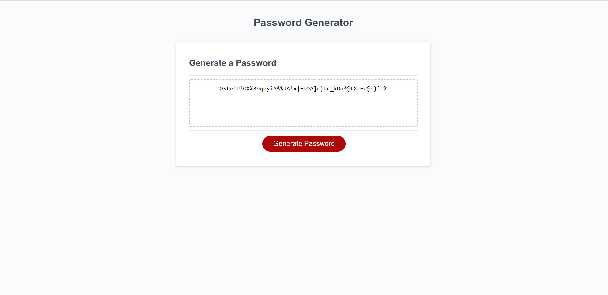

# generate-password
Random password generator that uses prompts, captures the data and generates a random password in the text area. 

Uses: 
*HTML  
*CSS   
*Javascript  

Check it out here!: https://swyner97.github.io/generate-password/ 